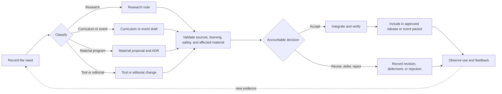

# SOP: Contributing to AI Dev Days

**Status:** Version 1.1.0<br>
**Accountable owner:** Founding steward or future governing body<br>
**Process manager:** Program maintainer<br>
**Prepared:** 2026-07-30<br>
**Review triggers:** Program release, Commons adoption change,
governance change, repeated contribution problem, disputed decision,
publication-safety incident, accessibility finding, or recurring tool drift

## Contribution License

By submitting material for inclusion in this repository, a contributor agrees
to license that contribution under the repository's
[MIT License](LICENSE.md). The contributor confirms that they have the right to
submit the material under those terms. No separate contributor license
agreement is required.

## Participation and Sensitive Material

Participation is governed by the [Code of Conduct](CODE_OF_CONDUCT.md).

Do not include secrets, private data, client or attendee records, confidential
material, private evidence, unsafe instructions, or improperly licensed content
in an issue, pull request, review, research note, event packet, or appeal.
Follow [`SECURITY.md`](SECURITY.md) for sensitive reports and
[`PUBLICATION-SAFETY.md`](PUBLICATION-SAFETY.md) for public material.

## 1. Purpose and Expected Outcome

This SOP governs how an AI Dev Days contribution is proposed, researched,
prepared, reviewed, decided, integrated, released, and maintained.

It applies to:

- charter, governance, and material program decisions;
- research notes and source updates;
- reusable curriculum, labs, and facilitator guidance;
- event packets and post-event evidence;
- tool-track and setup guidance;
- examples and sample projects;
- editorial corrections; and
- repository, validation, citation, or release material.

The expected outcome is a contribution that:

- addresses a clear learner, facilitator, researcher, or maintainer need;
- is classified according to its effect;
- respects the adopted Open Framework Commons boundary and AI Dev Days'
  independence;
- states sources, evidence, rights, assistance, limitations, and uncertainty
  honestly;
- is reviewed proportionately;
- receives an accountable and recorded disposition;
- updates affected material consistently; and
- preserves a useful change and maintenance history.

Contribution, publication, event use, or repeated reuse does not itself grant
authority, acceptance, professional validation, or framework status.

## Contribution Flow



## 2. Roles and Authority

Roles and decision authority are defined in [`GOVERNANCE.md`](GOVERNANCE.md).
Contributors and reviewers must not claim authority outside their assigned role
or stated expertise.

AI may assist with research, drafting, comparison, testing, or review. Disclose
material AI assistance when it affects provenance, review expectations, or the
nature of the contribution. AI does not approve a contribution or replace
human, learner, organizational, or professional review.

## 3. Classify the Contribution

Assign one primary class:

| Class | Examples | Decision path |
| --- | --- | --- |
| Charter amendment | Mission, founding commitment, scope, stewardship | Charter amendment and founding steward approval |
| Material program change | Framework relationship, research or education method, program identity, release policy | Decision record and accountable approval |
| Governance change | Roles, authority, appeals, contribution or release rules | Accountable governance decision |
| Research record | Source facts, analysis, gaps, recommendation | Research review and disposition |
| Curriculum change | Learning objective, reusable lab, facilitator standard, assessment | Curriculum review and validation |
| Event change | Audience, pacing, exercise, event-specific risk or evidence | Event owner approval |
| Tool-track change | Install steps, provider behavior, product-specific exercise | Primary-source and practical verification |
| Example or app change | Fictional scenario, sample output, sample code | Technical, educational, and publication review |
| Editorial change | Spelling, formatting, links, wording without changed meaning | Maintainer review |

When classification is uncertain, use the more consequential path until the
accountable authority decides otherwise.

## 4. Record the Need

Before substantive drafting, state:

- what is unclear, missing, stale, unsafe, inaccessible, or newly possible;
- who is affected;
- the requested outcome;
- why current material does not already resolve it;
- the likely contribution class;
- affected documents, events, tools, or learners;
- available sources, evidence, or operating experience;
- known urgency and consequences of delay;
- rights, privacy, safety, professional, or publication concerns; and
- the contributor or owner for follow-up.

Use a GitHub issue for a proposal, question, event, research need, or material
clarification. A small, ready editorial fix may begin as a pull request.

## 5. Research and Source Requirements

Research contributions follow
[`docs/research-and-education-method.md`](docs/research-and-education-method.md)
and use [`research/source-note-template.md`](research/source-note-template.md).

Prefer primary and authoritative sources. A substantive note records:

- question, date, researcher, and status;
- sources and capture dates;
- source facts separated from analysis;
- provenance, freshness, drift risk, conflicts, and uncertainty;
- relevance to Commons, any selected ecosystem product, and AI Dev Days;
- what should and should not be reused;
- rights, attribution, consent, and publication limits;
- remaining gaps and review needs; and
- a recommended disposition.

Claims about shared ecosystem principles cite the adopted
[Open Framework Commons v1.0.0](https://github.com/BradGroux/open-framework-commons/releases/tag/v1.0.0).
Claims about a specific framework cite that framework's canonical source.
Research may inform a proposal but cannot amend Commons, another product, or
AI Dev Days silently.

## 6. Draft the Smallest Complete Change

The draft:

- follows [`CHARTER.md`](CHARTER.md), accepted
  [decisions](decisions/README.md), the adopted Commons release, and current
  product-local guidance;
- keeps program-level learning vendor-neutral;
- treats OpenClaw, Codex, and other technologies as tool tracks;
- states learner, purpose, owner, outcome, boundary, and evidence;
- preserves explicit human authority and approval;
- distinguishes source, AI output, inference, and authoritative result;
- includes proportionate exception, stop, fallback, and recovery guidance;
- uses public, licensed, approved, anonymized, or fictional examples;
- uses date-first `event-specific/YYYY-MM-DD-<event-slug>/` folders;
- updates navigation, metadata, source notes, decisions, and change history when
  affected; and
- avoids broad rewrites unrelated to the recorded need.

An event packet should begin from [`event-specific/_template/`](event-specific/_template/).
Historical event context may remain point-in-time material, but current links
and status must be honest.

## 7. Validate the Contribution

### Contributor Review

Check:

- charter, governance, Commons, product independence, and accepted-decision
  alignment;
- research provenance and claim-to-source traceability;
- the intended learner, prerequisite, outcome, exercise, and evidence;
- normal, exception, and credible failure or recovery paths;
- responsibility, authority, permissions, privacy, safety, and stop
  conditions;
- accessibility, readability, timing, and mixed-skill support proportionately;
- tool-version assumptions and current official sources;
- local links, external links, event metadata, generated artifacts, and sample
  data;
- publication safety, attribution, license, and assistance disclosure;
- affected events, curriculum, research, and release material; and
- whether the change resolves its recorded need.

Record unresolved findings rather than hiding them behind polished wording.

### Required Review

Review is proportionate to consequence:

- editorial changes need confirmation that meaning is unchanged;
- research notes need source, provenance, boundary, and disposition review;
- curriculum needs learning-design and practical validation;
- event changes need event-owner review;
- tool-track changes need official-source and practical verification;
- sample apps need relevant tests and an educational fit check;
- professional or domain claims need review appropriate to the claim;
- accessibility changes need proportionate accessibility review; and
- rights, privacy, safety, security, or publication concerns need the
  corresponding authority.

Record who or what reviewed the contribution, scope, date, findings,
limitations, and resulting changes. Do not represent AI review as human or
professional approval.

## 8. Repository Verification

Run the repository gate:

```bash
./scripts/validate-release.sh
```

The gate runs publication safety, repository structure and local-link checks,
external-link checks, current fictional-demo verification, and Beaver Badges
application checks.

When changing generated PDFs, also verify:

- page count and 16:9 page size;
- first and last rendered pages;
- clickable links;
- absence of stale repository or event paths; and
- source HTML consistency.

When a check cannot run, record the missing check, reason, and consequence.
File presence alone does not prove the contribution is complete.

## 9. Submit, Decide, and Integrate

Open a pull request when the repository change is ready for review.

The pull request states:

- the problem and contribution class;
- what changed;
- sources and Commons or product-boundary effect;
- how learning or event behavior changes;
- verification performed;
- public, accessibility, domain, or tool-drift risks;
- known limitations and follow-up; and
- the issue it closes when applicable.

The accountable authority records one outcome:

- **Accept:** approved for integration;
- **Accept with conditions:** named conditions remain before completion or
  release;
- **Return for revision:** correctable findings are identified;
- **Defer:** a named source, review, event, or decision remains; or
- **Reject:** the reason and controlling program basis are recorded.

Accepted changes update all affected material and change history. Deferred or
rejected items retain their reason so the same question is not repeatedly
rediscovered.

## 10. Release, Observe, and Improve

Acceptance and publication are separate. A contribution enters an official
release only through the release process in [`GOVERNANCE.md`](GOVERNANCE.md).

After use:

- collect only proportionate, public-safe evidence;
- record event findings in the post-event review;
- distinguish event-specific findings from reusable program findings;
- give each material finding a disposition;
- reopen research when sources or underlying meaning changed;
- repeat proportionate validation and approval; and
- supersede stale entry points clearly.

## Stop Conditions

Stop integration, event use, or release when:

- the responsible authority has not approved a material change;
- the contribution conflicts with the charter, adopted Commons boundary, or
  an explicitly selected framework's own meaning;
- sources, rights, attribution, consent, or licensing remain unresolved;
- private, personal, confidential, unsafe, or security-sensitive material may
  remain;
- provenance, assistance, evidence, or review is misrepresented;
- professional claims exceed available review;
- required acceptance conditions remain incomplete; or
- affected material cannot be made internally consistent.

## Completion Evidence

A contribution is complete only when:

- the need, class, contributor, and requested outcome are recorded;
- required sources, rights, assistance, assumptions, and limitations are
  visible;
- required reviews are complete and bounded;
- the accountable authority has recorded a decision;
- accepted conditions are complete;
- affected files, links, metadata, artifacts, and change history are
  consistent;
- verification passes or unavailable checks and consequences are recorded;
- the accepted version is identifiable; and
- maintenance ownership or a review trigger remains clear.
