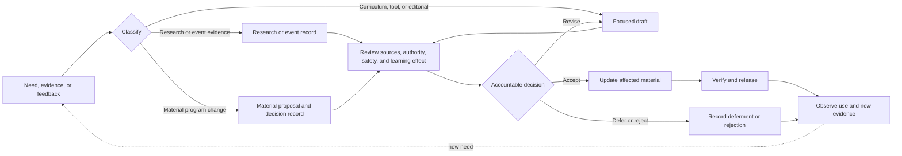

# AI Dev Days Governance

**Status:** Version 1.0.0 release candidate; pending founding steward approval  
**Founding steward:** Brad Groux  
**Prepared:** 2026-07-30

## Purpose

This document governs how AI Dev Days turns research and event experience into
maintained education without allowing a source note, tool track, event packet,
commercial practice, or AI-generated draft to redefine the program or the
AI-Native Operating Framework silently.

## Authority

Apply this order when program materials conflict:

1. Direct current instruction from the founding steward or future governing
   body.
2. [`CHARTER.md`](CHARTER.md).
3. Accepted records under [`decisions/`](decisions/README.md).
4. The canonical
   [research and education method](docs/research-and-education-method.md).
5. This governance document and [`CONTRIBUTING.md`](CONTRIBUTING.md).
6. Approved curriculum and reusable program standards.
7. Event packets and examples.
8. Tool-track instructions.
9. Research notes, planning records, and history.

The
[AI-Native Operating Framework](https://github.com/BradGroux/ai-native-operating-framework)
governs every framework term or claim regardless of this local order. AI Dev
Days cannot approve a framework change.

## Current Stewardship

Brad Groux is the creator and founding steward. Until governance expands, the
founding steward:

- approves charter amendments and material program decisions;
- protects the program's framework-companion boundary;
- approves versioned release baselines;
- delegates curriculum, research, event, tool-track, or repository
  maintenance;
- resolves escalated conflicts and appeals; and
- records material dissent, limitations, and unresolved risk.

The program is developed within
[Digital Meld](https://digitalmeld.io)'s research arm. That relationship does
not grant Digital Meld commercial material, client work, or marketing content
authority over the framework or this program.

## Roles

### Founding Steward or Future Governing Body

Holds program decision and release authority.

### Program Maintainer

Manages contribution intake, classification, consistency, repository
verification, change history, and release preparation within delegated
authority.

### Research Maintainer

Checks questions, sources, provenance, freshness, rights, public safety,
analysis boundaries, and the disposition of research findings.

### Curriculum Maintainer

Turns accepted findings and learning objectives into reusable curriculum,
validates instructional coherence, and keeps current material distinguishable
from historical material.

### Event Owner

Owns an event's purpose, audience, packet, approval, delivery boundaries,
evidence, recovery path, and post-event review.

### Tool-Track Maintainer

Maintains current, source-backed implementation guidance for a named tool
without presenting tool behavior as program or framework meaning.

### Contributor

Describes the need, supplies sources and rights, prepares a focused change,
discloses material assistance, responds to review, and does not represent a
proposal as accepted before an accountable decision.

### Reviewer

Reviews only the matters within their stated role or expertise. Review does not
transfer decision authority unless governance delegates it explicitly.

### AI Participation

AI may assist with research, drafting, comparison, exercises, consistency
review, and verification. AI does not hold governance authority, grant
publication rights, provide real-world experience it does not have, or
substitute for accountable domain review.

## Decision Classes

| Class | Typical effect | Required path |
| --- | --- | --- |
| Charter amendment | Mission, commitments, scope, stewardship, or amendment rules | Written proposal and founding steward or governing-body approval |
| Material program decision | Framework relationship, research or education method, authority, release policy, or program identity | Decision record and accountable approval |
| Governance change | Roles, decision authority, appeals, contribution, or release approval | Written governance decision |
| Research record | Source-grounded facts, analysis, gaps, or recommendation | Research review; no automatic program effect |
| Curriculum change | Reusable learning objective, lab, facilitator standard, or assessment | Curriculum review and proportionate validation |
| Event decision | Audience-specific adaptation, schedule, exercise, or accepted event risk | Event owner approval |
| Tool-track change | Install steps, provider behavior, or implementation guidance | Primary-source and practical verification |
| Editorial change | Wording, formatting, or links without changed meaning | Maintainer review |

When classification is uncertain, use the more consequential path until the
accountable authority decides otherwise.

## Decision Flow

Storage, publication, or repeated use does not make material authoritative.
Acceptance requires the decision path appropriate to its effect.

## Research Governance

Research follows
[`docs/research-and-education-method.md`](docs/research-and-education-method.md)
and begins with a visible question.

Every substantive research note states:

- date, author or researcher, and status;
- sources inspected and capture date;
- source facts separated from analysis and recommendations;
- provenance, freshness, uncertainty, and conflicting evidence;
- rights, reuse, privacy, and publication limits;
- relevance to the framework and program;
- what should and should not be reused;
- remaining gaps and required review; and
- a proposed disposition.

Research may be accepted as evidence, deferred, superseded, rejected, or
advanced into a program proposal. It cannot amend the charter, framework, or
curriculum merely by being published.

## Curriculum and Event Governance

Reusable curriculum must:

- state the intended learner, prerequisite, outcome, and evidence;
- preserve the program's framework boundary;
- identify source-backed claims and tool-specific assumptions;
- provide proportionate controls, recovery, and facilitator guidance;
- include a practical way to evaluate the result; and
- name maintenance ownership and review triggers.

Event packets adapt approved curriculum to a specific audience and date. They
may add context, pacing, examples, tools, and accepted limitations. They do not
become reusable program standards automatically.

Post-event evidence enters research or curriculum maintenance only after its
privacy, rights, provenance, and applicability are reviewed.

## Review Participation

Review should include the people needed for the consequence of the change:

- the accountable program or event owner;
- research and curriculum maintainers;
- practitioners who understand the represented work;
- learners or facilitators affected by the change;
- tool maintainers for drift-sensitive instructions;
- accessibility reviewers when the learning surface changes materially; and
- domain, legal, privacy, security, safety, licensing, or other authorities for
  claims within their responsibility.

AI review must not be represented as human, organizational, learner, or
professional approval.

## Releases and Versions

An approved release identifies:

- version and exact repository tag;
- effective date;
- framework compatibility baseline;
- material changes;
- known limitations and review status;
- superseded versions;
- responsible steward; and
- verification evidence.

Release preparation and publication are separate. Publication requires
explicit authorization from the founding steward or future release authority.

Before release:

1. run the repeatable repository validation gate;
2. verify the release candidate from a clean checkout;
3. inspect local and external links, event metadata, generated PDFs, sample
   apps, workflows, and publication safety;
4. confirm research provenance and framework citations;
5. confirm current and historical content are distinguishable;
6. record unavailable checks and their consequences;
7. obtain explicit release approval; and
8. create an annotated tag and GitHub release from the approved commit.

### Prepared Version 1.0.0 Baseline

- **Version:** 1.0.0 release candidate
- **Framework compatibility:** AI-Native Operating Framework 1.0.0
- **Prepared date:** 2026-07-30
- **Repository tag:** `v1.0.0`, not yet authorized
- **Superseded public version:** none
- **Responsible steward:** Brad Groux
- **Known limitations:** event outcomes have not yet been measured under the
  complete research-to-education method; several examples are tool-specific;
  domain and accessibility review varies by event; historical event packets
  retain point-in-time tool assumptions

## Conflicts and Appeals

Conflicting interpretations are recorded and routed to the authority
responsible for the disputed meaning. Material dissent remains visible with the
decision.

An appeal identifies:

- the disputed contribution or decision;
- the claimed classification, evidence, authority, or process problem;
- the requested resolution; and
- any publication or safety constraint.

The founding steward or future governing body records whether the decision is
upheld, revised, reopened, or deferred. When the steward made the disputed
decision, an uninvolved reviewer should participate when practical and the
governance limitation must be stated.

## Governance Review

Review this document when:

- participation or event scale changes materially;
- the framework publishes a potentially incompatible release;
- decision or maintenance authority changes;
- research repeatedly fails to reach a clear disposition;
- learners or contributors cannot identify current guidance;
- repeated publication, accessibility, or tool-drift failures occur;
- an appeal exposes unclear authority; or
- a release reveals a missing control.
