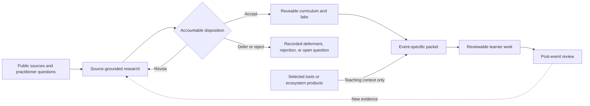
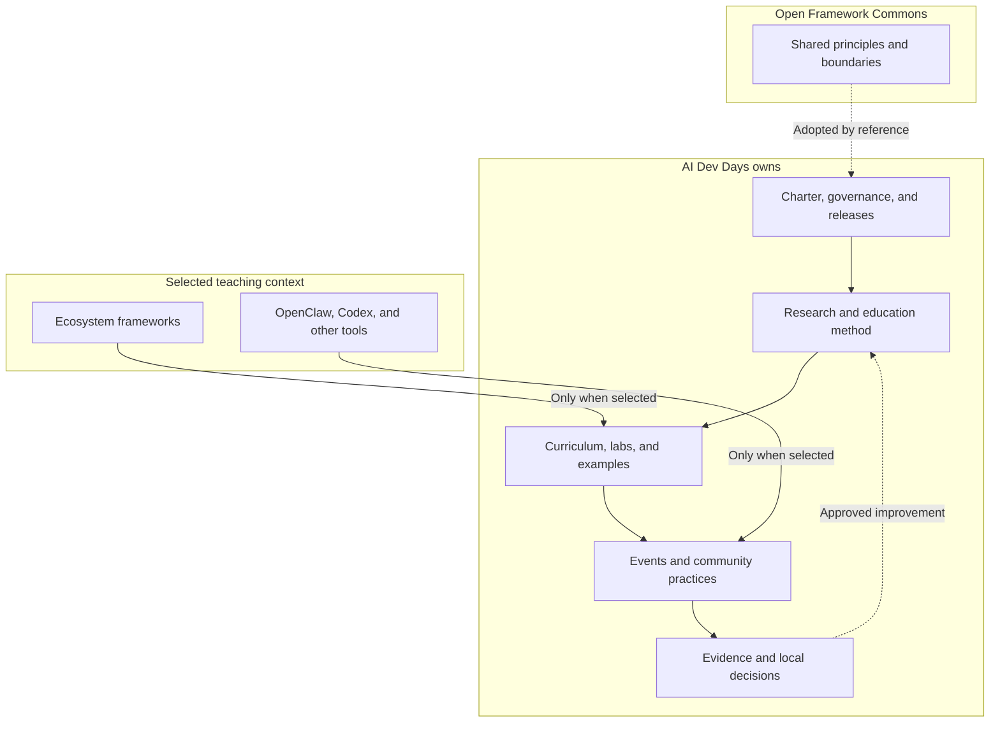

# AI Dev Days Program Map

These diagrams are orientation aids for readers. The linked charter,
governance, methods, and decisions remain authoritative.

## From Research to Reusable Learning

Read the flow from left to right:

1. Public sources and practitioner questions become bounded research, not
   instructions by default.
2. An accountable AI Dev Days decision accepts, revises, defers, or rejects a
   proposed lesson.
3. Approved learning becomes reusable curriculum before an organizer adapts it
   into an event-specific packet.
4. Selected tools or ecosystem products provide teaching context only.
5. Reviewable learner work and post-event observations return as new evidence;
   they do not become standards automatically.

The canonical process is the
[research and education method](research-and-education-method.md). Event
delivery uses the [facilitator runbook](../RUNBOOK.md) and
[event template](../event-specific/_template/README.md).

## Shared Foundation and Local Ownership

The boundary is deliberate:

- [Open Framework Commons v2026.09.05](https://github.com/BradGroux/open-framework-commons/releases/tag/v2026.09.05)
  is authoritative for the shared principles and boundaries AI Dev Days adopts
  by reference.
- [AI Dev Days](../CHARTER.md) is authoritative for its purpose, method,
  curriculum, events, community practices, governance, roadmap, and releases.
- A selected framework remains authoritative for its own meaning, and a
  selected tool remains implementation context. Neither gains authority over
  the AI Dev Days program.
