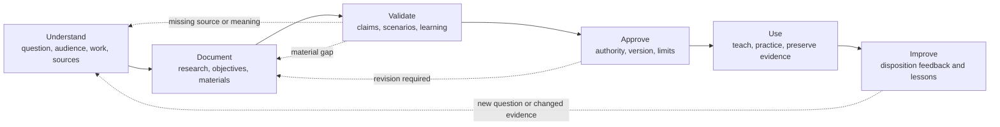

# AI Dev Days Research and Education Method

**Status:** Version 1.1.0 
**Owner:** AI Dev Days founding steward or delegated program maintainer 
**Prepared:** 2026-07-30 
**Commons adoption:** [Open Framework Commons v1.0.0](https://github.com/BradGroux/open-framework-commons/releases/tag/v1.0.0) at `a0f0d384e9010a65d1a21a324b4c912433d5e031`

## Purpose

This method explains how AI Dev Days investigates a question, turns supported
findings into education, uses that education with learners, and improves it
from evidence.

This is an AI Dev Days-owned, product-local method. Its maintenance sequence is:

1. Understand
2. Document
3. Validate
4. Approve
5. Use
6. Improve

These are program-maintenance activities. They are not a Commons requirement
or a mandatory lifecycle for every learner, event, business process, or
research question. When a lesson selects another ecosystem product, a separate
teaching guide may map this method to that product without transferring
authority over AI Dev Days.

## Method at a Glance

## Principles

### Begin with a real question or learning need

Research starts with a question. Education starts with an intended learner,
context, and outcome. A tool announcement or available demo is not enough.

### Learn from the people who know the work

Process owners, practitioners, recipients, learners, facilitators, and control
authorities hold different knowledge. The method seeks the perspectives needed
for the consequence of the material.

### Use primary and authoritative sources

Prefer the source that owns the claim:

- the adopted Commons release for shared ecosystem principles and boundaries;
- canonical framework documents when making claims about a named framework;
- official product documentation and source code for tool behavior;
- laws, regulations, standards, and government publications for public
  requirements;
- original research for research findings;
- accountable practitioner records for operating experience; and
- event evidence for what happened in an AI Dev Days event.

Secondary sources may identify questions or explain context. They should not
replace an available primary source.

### Separate facts, analysis, and decisions

A research note distinguishes:

- what a source states or demonstrates;
- what the researcher infers;
- what remains uncertain or conflicting;
- what the program should or should not reuse; and
- what an accountable maintainer decided.

Publication does not collapse those categories.

### Resolve meaning before polishing materials

Missing purpose, unclear authority, conflicting sources, undefined outcomes,
or unknown learner prerequisites cannot be repaired through better slides.

### Make learning experiential and contextual

Learners should use AI in a recognizable context, create an artifact, evaluate
the result, and retain a continuation path. A feature tour may support the
experience but should not be the experience.

### Evaluate normal, exception, and failure paths

Materials should show more than a clean demonstration. Proportionate exercises
and facilitator preparation consider:

- missing or conflicting inputs;
- uncertainty and unsupported output;
- permission or authority boundaries;
- failed setup and recovery;
- unavailable tools or participants;
- unsafe or private material;
- incomplete evidence; and
- disagreement about completion.

### Keep tools replaceable

Tool tracks supply implementation context. Learning objectives, operating
meaning, and evidence expectations should remain useful when a model, platform,
or vendor changes.

### Preserve program operating memory

Material sources, provenance, decisions, current state, evidence, handoffs,
feedback, and accepted lessons remain available under proportionate controls.
Raw chat history and individual recollection are not sufficient program memory.

### Improve from evidence

Event outcomes, learner artifacts, facilitator observations, exceptions,
incidents, source changes, accessibility findings, and contributor feedback
lead to recorded review and disposition.

## Roles

Roles may be combined when scale and risk permit.

### Accountable Program Owner

Owns the intended program outcome and approves material program changes.

### Researcher

Frames the question, inspects sources, records provenance and limitations,
separates facts from analysis, and proposes a disposition.

### Practitioner or Domain Reviewer

Checks whether operating or professional claims match the represented work.
Review is limited to the reviewer's stated experience and authority.

### Learning Designer or Curriculum Maintainer

Defines the learner, objective, practice, evidence, facilitator support,
accessibility needs, and continuation path.

### Event Owner and Facilitator

Approves the event adaptation, prepares the room and recovery paths, runs the
experience, protects participants, and captures public-safe evidence and
lessons.

### Learner

Brings context, performs the work, evaluates results, respects the event
boundary, and decides what personal or organizational use is appropriate after
the event.

### Tool-Track Maintainer

Verifies drift-sensitive instructions and keeps tool claims separate from
program or framework claims.

## Activity 1: Understand

### Objective

Establish why the research or education exists, who it serves, what work it
represents, and which sources, authorities, constraints, and gaps matter.

### Research Actions

- state the question and why it matters;
- identify the intended program or learner decision;
- inspect existing research, accepted decisions, curriculum, and event
  evidence;
- identify primary sources and their owners;
- record source date, version, provenance, freshness risk, rights, and access;
- identify conflicts, missing evidence, and review needs; and
- exclude private, unsafe, or improperly licensed material.

### Education Actions

- identify learners, prerequisites, accessibility needs, and context;
- state the intended outcome and evidence;
- identify the people who know the represented work and its exceptions;
- identify applicable framework concerns and public requirements;
- select tool tracks only after the need is understood; and
- name risks, boundaries, support needs, and unresolved questions.

### Ready to Continue When

- the question, audience, owner, outcome, sources, constraints, and gaps are
  visible;
- unknowns have owners rather than guesses; and
- the work can be documented without crossing publication or professional
  boundaries.

## Activity 2: Document

### Objective

Create a reviewable research record and the smallest complete educational
material that can produce the intended learning.

### Research Output

Use [`research/source-note-template.md`](../research/source-note-template.md) to
record:

- source facts;
- analysis;
- relevance to Commons, any selected ecosystem product, and AI Dev Days;
- what should and should not be reused;
- remaining gaps; and
- a recommendation or disposition.

### Education Output

State:

- learner and prerequisite;
- purpose, scope, and expected outcome;
- exercise, inputs, decisions, handoffs, and output;
- human and AI responsibilities and authority;
- permissions, safety, privacy, and stop conditions;
- completion criteria, checks, reviewer, and evidence;
- setup, fallback, and recovery;
- source links and tool-version assumptions; and
- follow-up, maintenance owner, and review triggers.

The material does not need these as matching headings. It must communicate the
meaning clearly.

### Ready to Continue When

- source facts and interpretation are distinguishable;
- the learning activity produces a reviewable result;
- boundaries and limitations are visible; and
- the draft can be walked through in realistic scenarios.

## Activity 3: Validate

### Objective

Determine whether the research is supportable and the education is accurate,
usable, safe, and capable of producing its intended evidence.

### Research Validation

- open every material source;
- confirm claims against the source and applicable version;
- check whether a newer or higher-authority source supersedes it;
- review conflicting evidence and inference;
- verify quotation, attribution, license, and reuse;
- confirm public safety and data minimization; and
- identify domain or professional review that remains absent.

### Education Validation

- walk through the normal learner path;
- test meaningful exceptions and failure or recovery paths;
- verify setup, links, sample data, generated artifacts, and checks;
- confirm the learner can distinguish source, AI output, inference, and
  authoritative result;
- confirm the facilitator can support mixed-skill participation;
- inspect accessibility, readability, timing, and fallback material
  proportionately;
- confirm tool-specific material does not redefine Commons, AI Dev Days, or a
  selected ecosystem product; and
- record unresolved limitations for the approver.

### Ready to Continue When

- material claims are traceable;
- the activity can produce and verify the intended result;
- normal, exception, and recovery paths are understandable; and
- unresolved limitations are visible.

## Activity 4: Approve

### Objective

Authorize an identifiable research disposition, curriculum version, or event
packet for its stated use.

### Actions

- confirm accountable ownership and decision class;
- confirm required source, program, event, tool, accessibility, and domain
  reviews;
- decide whether research is accepted as evidence, deferred, superseded,
  rejected, or advanced into a proposal;
- identify the approved curriculum or event version and effective date;
- record limitations, accepted risk, maintenance owner, and review triggers;
- update affected decisions and change history; and
- distinguish approval for use from public release authorization.

### Ready to Continue When

- the responsible authority has made and recorded the decision;
- the usable version and limitations are identifiable; and
- publication, delivery, and maintenance conditions are clear.

## Activity 5: Use

### Objective

Make the approved material part of an actual learning experience while
preserving evidence and participant safety.

### Actions

- use the current approved material;
- communicate the purpose, boundary, safety checkpoint, and success criteria;
- help learners reach a first useful result;
- keep human decision and approval points explicit;
- preserve required evidence without collecting unnecessary personal data;
- record material exceptions, recovery actions, and unresolved questions;
- provide a continuation and feedback path; and
- mark outdated or event-specific guidance honestly.

### Useful Evidence

Evidence may include:

- a learner-created public-safe artifact;
- a passed deterministic or human review;
- a completed rubric or checklist;
- a documented exception and recovery;
- an event-level count or rate that has a defined denominator and collection
  method;
- structured learner or facilitator feedback; and
- a public-safe decision, handoff, or follow-up record.

Attendance, applause, slide count, model output volume, or an unverified demo
does not prove learning.

## Activity 6: Improve

### Objective

Turn evidence and experience into accountable changes rather than letting
curriculum drift through repetition.

### Review Inputs

Consider:

- learner outcomes and artifacts;
- verification results;
- repeated questions and support failures;
- exceptions, incidents, and recoveries;
- facilitator and learner feedback;
- accessibility findings;
- source, framework, policy, or tool changes;
- unhelpful or unused material;
- misleading examples or unsupported claims; and
- evidence that learners could not continue after the event.

### Actions

- record the finding and affected material;
- distinguish an event adaptation from a reusable program change;
- return to Understand when the underlying question or meaning changed;
- update research, curriculum, templates, or tool tracks through the
  appropriate contribution class;
- repeat proportionate validation and approval;
- preserve the decision and change history; and
- supersede or retire outdated entry points.

### Complete When

- evidence and feedback have a recorded disposition;
- accepted changes are verified and in use;
- deferred or rejected findings retain a reason; and
- the next review owner or trigger is clear.

## Research-to-Education Disposition

| Research disposition | Meaning | Program effect |
| --- | --- | --- |
| Accepted as evidence | Sources and bounded findings are usable for the stated question | May support a curriculum or program proposal |
| Advance to proposal | The finding warrants a specific change | Enters the appropriate decision or contribution path |
| Defer | A named source, review, event, or decision is missing | No current material change |
| Supersede | A newer or higher-authority record replaces the note | Old note remains historical and clearly marked |
| Reject | Evidence, rights, relevance, or safety does not support reuse | No material change; reason remains visible |

No research disposition changes Commons or another ecosystem product. A
proposed change must use the repository and decision process of the product
that owns the affected meaning.

## Product-Local Completeness Lenses

| Lens | Research and education question |
| --- | --- |
| Intent | Why does this research or learning exist, for whom, and with what outcome? |
| Responsibility | Who researches, teaches, participates, decides, reviews, and maintains? |
| Work | What sources, activities, decisions, handoffs, and outputs matter? |
| Control | Which rights, safety, privacy, permissions, exceptions, stop conditions, and recovery paths apply? |
| Assurance | What checks, evidence, provenance, and review demonstrate a trustworthy result? |
| Learning | How are outcomes, feedback, source changes, and lessons dispositioned and maintained? |

These are AI Dev Days completeness lenses, not Commons requirements or
mandatory agenda phases.

## Program Measures

Use measures only when their definition, collection method, denominator,
privacy treatment, and owner are clear. Useful program measures may include:

- learners who reached the stated first-success checkpoint;
- learners who produced a reviewable artifact;
- artifacts that passed the stated verification;
- learners who correctly identified an authority or permission boundary;
- recovery paths used and resolved;
- source or tool failures encountered;
- follow-up work continued after the event; and
- accepted curriculum improvements traced to event evidence.

Do not invent metrics or turn anecdotal feedback into a rate.

## Stop Conditions

Stop research reuse, curriculum approval, event delivery, or release when:

- material claims cannot be traced to an appropriate source;
- the Commons or selected-product boundary is contradicted or unclear;
- source rights, consent, attribution, or publication safety is unresolved;
- private, personal, confidential, or security-sensitive material may remain;
- professional claims exceed available review;
- the learner activity requires authority or access the event cannot grant
  safely;
- required validation or approval is incomplete; or
- the result would be represented more strongly than the evidence supports.

## Related Documents

- [AI Dev Days Charter](../CHARTER.md)
- [Governance](../GOVERNANCE.md)
- [Contribution SOP](../CONTRIBUTING.md)
- [AI-Native Operating Framework teaching alignment](ai-native-operating-framework-alignment.md)
- [AI Literacy Framework alignment](ai-literacy-framework-alignment.md)
- [Research notes](../research/README.md)
- [Event template](../event-specific/_template/README.md)
- [Publication safety](../PUBLICATION-SAFETY.md)
