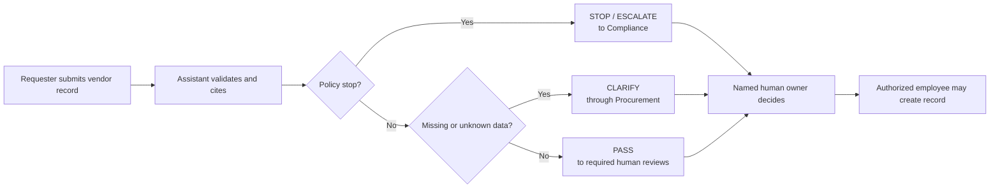

# Worked Example: Make Vendor Onboarding AI-Ready

This fictional example shows what a completed five-column canvas can look like
before anyone writes automation or connects a business system.

## Workflow statement

> When a requester submits a new-vendor request, Procurement Operations uses
> the intake record and approved policy to prepare a review packet, subject to
> human approval and stop conditions, and we know it worked when the packet has
> a traceable result, owner, cited evidence, and no unauthorized action.

## Completed canvas

| People | Process | Data | Guardrails | Proof |
|---|---|---|---|---|
| **Owner:** Procurement Operations **Participants:** requester, Finance, Security, Legal, Compliance **Decision makers:** each review function owns its domain decision; an authorized employee alone creates the vendor | **Trigger:** requester submits a new-vendor request **Core work:** check duplicates, validate required fields, identify review lanes, prepare focused questions **Exceptions:** missing information, security unknowns, contract deviations, possible sanctions matches | **Authoritative inputs:** intake record and approved policy excerpts **Required data:** identity, tax, spend, payment, access, contract, duplicate, and sanctions fields **Missing or conflicting data:** remains visible and returns for clarification | The assistant may draft, check, cite, and route only. It may not approve a vendor, resolve domain flags, contact stakeholders, or create a system record. A possible sanctions match always stops and escalates the workflow. | Each packet has exactly one result: **PASS**, **CLARIFY**, or **STOP / ESCALATE**. The result identifies the next human owner and cites the supporting rule and fields. Prepared normal, incomplete, and prohibited scenarios produce the expected result. |

## Smallest reviewable win

Generate a draft vendor-review packet from fictional source files, then let a
human verify its classification, evidence, missing information, and next owner.
No approval, notification, or system update occurs.

## What the example exposes

- A complete record can pass to human review without being approved.
- Unknown security information produces focused clarification questions.
- A possible sanctions match stops the workflow even when the request is
  marked urgent.
- The most important automation boundary is often a decision the system must
  leave to an accountable person.

## Supporting artifacts

- [Source notes and policy](demo/source/)
- [Completed process brief](demo/workspace/process-brief.md)
- [Data contract](demo/workspace/data-contract.md)
- [SOP](demo/workspace/vendor-onboarding-sop.md)
- [PRD](demo/workspace/vendor-onboarding-assistant-prd.md)
- [PASS, CLARIFY, and STOP scenarios](demo/workspace/acceptance-scenarios.md)

Use the blank [AI-ready workflow workbook](attendee-workbook.md) to map another
workflow with the same questions.
