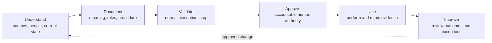

# AI-Native Operating Framework Guidance for This Demo

- Purpose: event-specific application guide
- Status: teaching aid, not Northstar policy and not a framework conformance claim
- Reviewed framework baseline: `b458ef2a6d0643a7ae96d52ceababbf2ef265f1c`
- Canonical project: <https://github.com/BradGroux/ai-native-operating-framework>

The [AI-Native Operating Framework](https://github.com/BradGroux/ai-native-operating-framework)
is the guiding business lens for this demo. It does not determine whether a
fictional vendor passes, needs clarification, or stops. Approved Northstar
policy determines those results.

## Guiding principles

1. People and AI participate under the same business standards and SOPs.
2. Accountable human ownership remains explicit.
3. Business meaning must remain independent of the current model, tool, file
   format, or automation platform.
4. Shared operating memory preserves sources, context, decisions, work state,
   evidence, handoffs, and lessons without making every stored item
   authoritative.
5. Organizations apply the framework to their existing business lifecycle;
   the framework does not impose a universal workflow.

## Six-concern lens

| Concern | Question for the business analyst | Demo evidence |
|---|---|---|
| Intent | Why does the work exist, what is in scope, and what outcome matters? | Process brief and assistant PRD |
| Responsibility | Who owns, performs, decides, approves, receives, and escalates? | Actor map, review lanes, and authority boundaries |
| Work | What triggers the work, what data and steps are required, and how do handoffs behave? | Current-state flow, data contract, SOP, and skill |
| Control | What policies, approvals, exceptions, stop conditions, and recovery paths apply? | Policy precedence, workspace instructions, and escalation rules |
| Assurance | What makes the work complete and correct, and what evidence proves it? | Acceptance scenarios, citations, tests, and verification report |
| Learning | Who reviews outcomes and exceptions, and how do approved changes return to the process? | Memory warning, change history, and post-event review |

The artifacts do not need six matching headings. They need to communicate the
business meaning clearly enough for people and AI to perform, review, and
improve the work.

## Maintenance boundary used in the demo

The framework method is **Understand → Document → Validate → Approve → Use →
Improve**.

- The live session demonstrates Understand, Document, and Validate.
- The fictional assistant never performs Approve.
- Use would require the organization's normal governance and systems.
- Improve requires evidence, an accountable maintainer, and approved change.

## SOP completeness check

When drafting or challenging an SOP, confirm it communicates:

1. identification and authority;
2. purpose, scope, and outcomes;
3. inputs, sources, outputs, and records;
4. roles, responsibility, and authority;
5. activities, decisions, and handoffs;
6. controls, exceptions, escalation, stop, and recovery;
7. completion, verification, and evidence; and
8. maintenance, review, and improvement.

## Reviewed canonical sources

- [Operating framework at the reviewed baseline](https://github.com/BradGroux/ai-native-operating-framework/blob/b458ef2a6d0643a7ae96d52ceababbf2ef265f1c/framework/operating-framework.md)
- [SOP content standard at the reviewed baseline](https://github.com/BradGroux/ai-native-operating-framework/blob/b458ef2a6d0643a7ae96d52ceababbf2ef265f1c/framework/sop-content-standard.md)
- [Standards maintenance method at the reviewed baseline](https://github.com/BradGroux/ai-native-operating-framework/blob/b458ef2a6d0643a7ae96d52ceababbf2ef265f1c/framework/standards-maintenance-method.md)
- [Shared operating memory standard at the reviewed baseline](https://github.com/BradGroux/ai-native-operating-framework/blob/b458ef2a6d0643a7ae96d52ceababbf2ef265f1c/framework/shared-operating-memory-standard.md)
