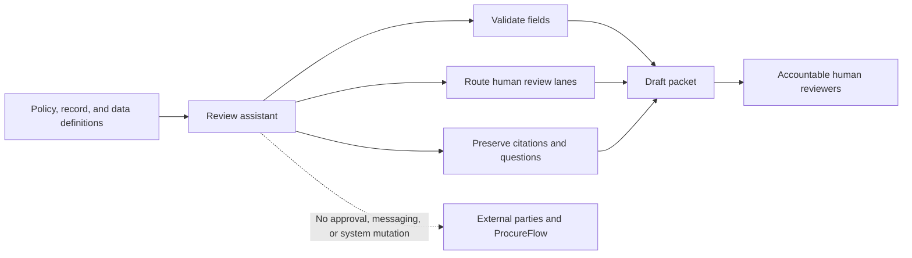

# PRD: Vendor-Onboarding Review Assistant

- Status: workshop example
- Product owner: Procurement Operations
- Decision owners: Finance, Security, Legal, Compliance, and authorized vendor
  administrators

## Problem

Vendor requests arrive with inconsistent data. Procurement spends time finding
missing fields, determining which review teams apply, and explaining why a
request cannot move forward. Important rules are distributed across people and
documents, which makes outcomes difficult to trace.

## Outcome

Create a draft-only assistant that converts one fictional intake record into a
consistent, source-cited review packet for the correct human owners.

## Users

- Procurement coordinator preparing the packet
- Business requester correcting missing information
- Finance, Security, Legal, and Compliance reviewers
- Process owner auditing consistency and exceptions

## In scope

- validate the required intake fields
- distinguish facts, missing data, conflicts, and unresolved policy
- identify required human review lanes
- classify the packet as PASS, CLARIFY, or STOP / ESCALATE
- cite policies and source fields
- produce focused questions and the next human owner
- compare results with acceptance scenarios

## Out of scope

- creating, approving, rejecting, activating, or modifying a vendor
- sending a message or updating ProcureFlow
- executing a contract or changing payment settings
- making a Finance, Security, Legal, Compliance, or duplicate-resolution
  decision
- deciding from a legal-spend threshold or low-risk definition that has not
  been approved
- processing real tax identifiers, bank data, credentials, or vendor records

## Functional requirements

| ID | Requirement |
|---|---|
| FR-01 | Select exactly one vendor record by vendor ID. |
| FR-02 | Validate all P-02 fields against the data contract. |
| FR-03 | Apply P-04 before less severe outcomes and ignore rush as an override. |
| FR-04 | Treat unknown security-trigger fields as requiring clarification and Security review. |
| FR-05 | Identify all applicable human review lanes without claiming their decisions. |
| FR-06 | Return only PASS, CLARIFY, or STOP / ESCALATE as the top-level result. |
| FR-07 | Cite request ID, vendor ID, source fields, and policy identifiers. |
| FR-08 | Name the next human owner and state that no external action was taken. |

## Quality and governance requirements

| ID | Requirement |
|---|---|
| QR-01 | The same checked-in inputs and rules produce the same expected classification. |
| QR-02 | Unsupported claims remain visible as assumptions or questions. |
| QR-03 | Required team rules live in checked-in guidance, not memory alone. |
| QR-04 | The fixture set contains no real company, vendor, banking, credential, or tax-identifier data. |
| QR-05 | A human can trace every outcome from record to policy to acceptance scenario. |

## Acceptance criteria

- V-001 returns PASS and names Procurement and Finance review without implying
  vendor approval.
- V-002 returns CLARIFY, names Security, and asks whether company data or system
  access applies.
- V-003 returns STOP / ESCALATE under P-04 to Compliance even though rush is
  requested.
- Every result contains the required evidence contract from `AGENTS.md`.
- `node ../verify-demo.mjs` passes from this folder.

## Success measure

During the workshop, attendees can trace why each prepared case reached its
outcome and identify which artifact must change when a business rule changes.

## Risks

| Risk | Mitigation |
|---|---|
| PASS is interpreted as approval | Use “ready for human review” in every PASS explanation. |
| Missing data is guessed | Treat absent, invalid, or unknown required values as CLARIFY. |
| Memory becomes shadow policy | Keep the authority warning in memory and source precedence in `AGENTS.md`. |
| A live response drifts | Compare with checked-in scenarios and switch to the prepared report. |
| Demo data resembles real data | Use fictional names and `.example` addresses only; include no sensitive values. |
