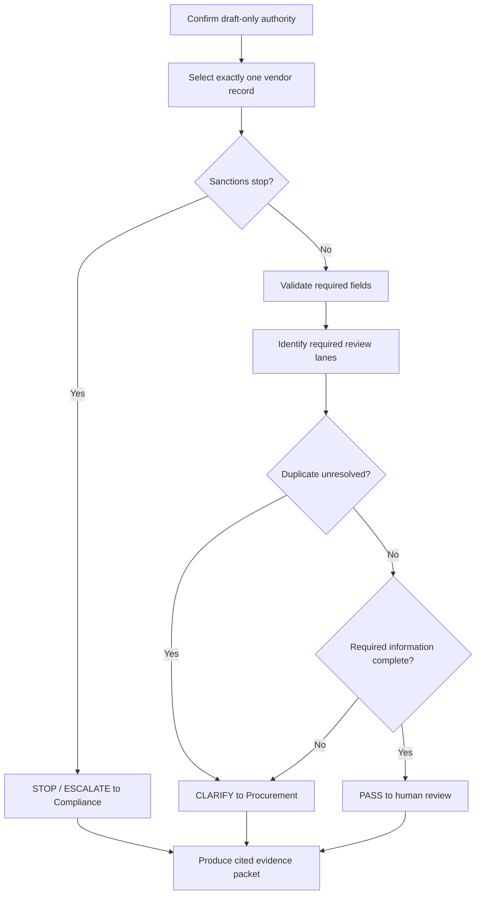

# SOP: Prepare a Vendor-Review Packet

- SOP ID: NSFS-PROC-001
- Status: workshop-approved procedure for fictional fixtures
- Owner: Procurement Operations
- Purpose: produce a source-grounded draft for human review without taking an
  external action

## Inputs

- one record from `../source/sample-vendors.json`
- approved policy excerpts
- current data contract and glossary

## Output

A review packet containing:

- PASS, CLARIFY, or STOP / ESCALATE
- vendor and request IDs
- facts used
- missing or conflicting information
- applicable policy identifiers
- required human review lanes
- next human owner and action
- confirmation that no external action was taken

## Procedure

### 1. Establish the authority boundary

Read P-01 and confirm the work is draft-only. If asked to create, approve,
reject, activate, modify, message, contract, pay, or clear a flag, refuse that
action and name the human owner.

### 2. Select the record

Match the requested vendor ID exactly. If zero or multiple records match,
return CLARIFY to Procurement.

### 3. Check stop conditions first

Read `sanctionsScreeningResult`.

- `possible_match` or `confirmed_match`: return STOP / ESCALATE under P-04 to
  Compliance. Continue only far enough to record evidence and missing fields.
- `unknown`: include Compliance and return CLARIFY unless a stop condition from
  another approved rule applies.
- `clear`: continue.

Rush status never changes this step.

### 4. Validate required fields

Check every P-02 field against `data-contract.md`. Treat absent, empty, invalid,
or `unknown` values as missing when the field is required for a decision.

If required information is missing, prepare focused questions and return
CLARIFY after identifying the necessary review lanes.

### 5. Identify review lanes

- Finance: always.
- Security: when any software, company-data, system-connection, or credential
  indicator is `yes` or `unknown`.
- Legal: when `contractDeviation` is `yes`; CLARIFY if it is `unknown`.
- Compliance: when sanctions screening is not `clear`.
- Procurement: always coordinates intake and duplicate review.

Do not use the unresolved spend threshold or “low risk” label.

### 6. Evaluate duplicate status

- `no_match`: record and continue.
- `possible_match`, `confirmed_duplicate`, or `unknown`: return CLARIFY to
  Procurement. Do not merge or discard records.

### 7. Assign the result

Use the highest-severity applicable outcome:

1. STOP / ESCALATE
2. CLARIFY
3. PASS

PASS means ready for the named human reviews. It never means approved.

### 8. Produce evidence

Cite the vendor ID, request ID, source field names, policy IDs, review lanes,
and next human owner. State: “No external action was taken.”

## Quality checks

- [ ] Every claimed fact exists in the selected source record.
- [ ] Every rule cites approved policy or an approved workspace artifact.
- [ ] Unknown values were not treated as negative answers.
- [ ] Rush status did not bypass a rule.
- [ ] Unresolved terms were not used as policy.
- [ ] The next human owner is named.
- [ ] The output does not expose sensitive or nonexistent data.
- [ ] No external action was taken.

## Change control

When policy changes, update the policy excerpt first, then review this SOP, the
data contract, skill, acceptance scenarios, and verification report in the same
change. A remembered practice or one-off stakeholder comment does not change
the SOP.
